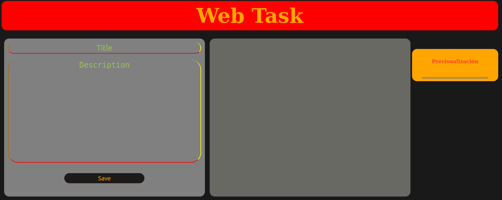
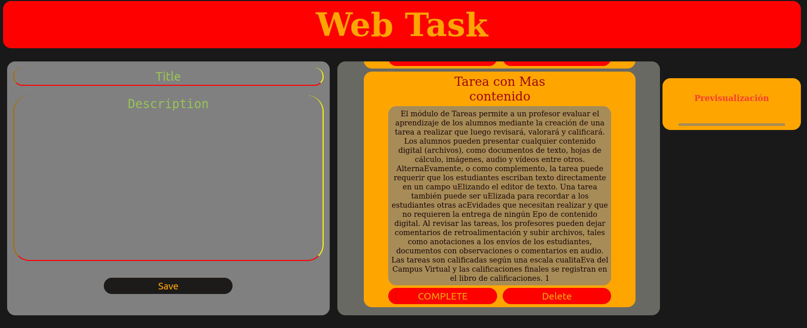
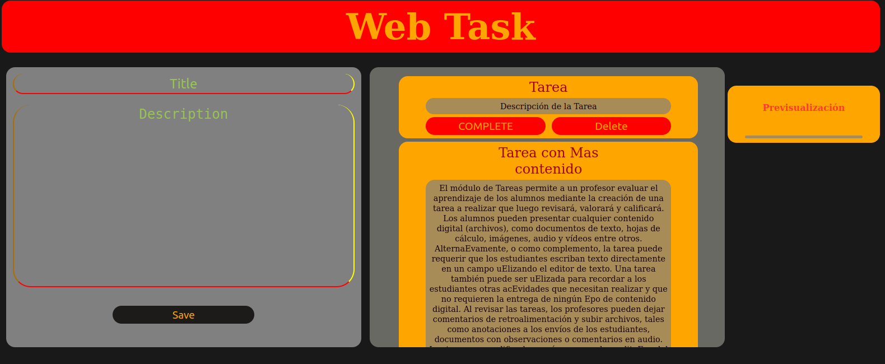

# 

**Angular component to use on any website**

## new style

# 

## Adding task

# 

## Added Task 

# 

## More Content

# 

## Homework complete

# 

## Incomplete homework

# 

## Deleted Task

# 